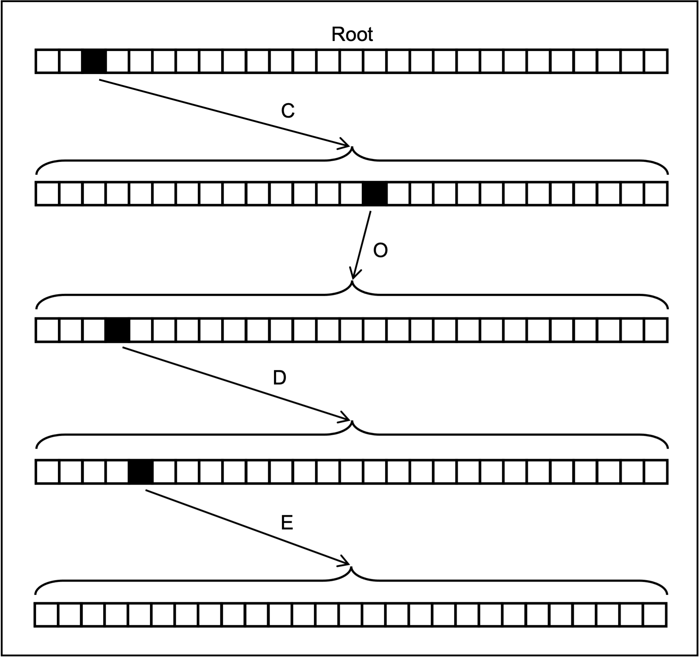

# Dictionary Abstract Data Type

This repository contains an implementation of a dictionary abstract data type (ADT). Well-suited for applications 
such as spell-checking and predictive text, the dictionary ADT allows for efficient querying of a collection of
similar strings.

## Usage
1. Download the files `t27.c` and `t27.h`, and place them inside your project directory
2. Add the following line to the top line of your project code or header file:
```
#include "t27.h"
```
3. When compiling your code, include `t27.c` as a dependency along with any other C files:
```
gcc main.c t27.c -o dictionary_program
```

### Supported Operations
- Create a new dictionary
```c
dict* dict_init(void);
```

- Add a string to a dictionary
```c
bool dict_addword(dict* p, const char* wd);
```

- Get the total number of nodes in a dictionary
```c
int dict_nodecount(const dict* p);
```

- Get the number of times a word has been added to a dictionary
```c
int dict_wordcount(const dict* p);
```

- Get the terminal node from a string, given the string is in the dictionary
```c
dict* dict_spell(const dict* p, const char* str);
```

- Get the frequency of the most common string in the dictionary
```c
int dict_mostcommon(const dict* p);
```

- Get the number of nodes separating two different nodes in the same dictionary
```c
unsigned dict_cmp(dict* p1, dict* p2);
```

- Given a string, `wd`, find the most common word in a dictionary beginning with this string. The characters from this most common word that are not found in the original string are assigned to `ret`.
```c
void dict_autocomplete(const dict* p, const char* wd, char* ret);
```

- Free all memory associated with a dictionary
```c
void dict_free(dict** p);
```


## Implementation
Strings are stored using a trie-like data structure, where each node is a structure composed of an array of 27 
pointers to child-nodes, a pointer to the parent node (NULL if node is root), a boolean representing if the node 
is terminal, and a integer representing the frequency of a word in the dictionary (only used in terminal nodes).

```c
struct dict {
    struct dict* child_nodes[27];
    struct dict* parent_node;
    bool terminal;
    int freqency;
};
```

Each pointer to a child node encodes a single character, where its position in the child_nodes[] array encodes 
the specific character. This array can hold up to 27 pointers, with the first 26 of them encoding the letters 
A–Z and the final one encoding the apostrophe character. A representation of the encoding of the string 'CODE' 
is shown below.

<div align="center">
    
</div>

Given the execution of the following code:
```c
dict* d = dict_init();
dict_addword(d, "code");
dict_addword(d, "code");
dict_addword(d, "coder");
dict_addword(d, "coda");
```

the dictionary state can be represented as:

<div align="center">
    
</div>

Here, nodes displaying a number are terminal, where that number indicates the frequency of the string in the 
dictionary.
